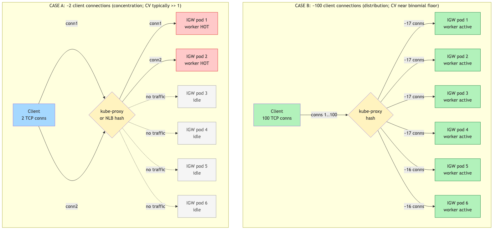
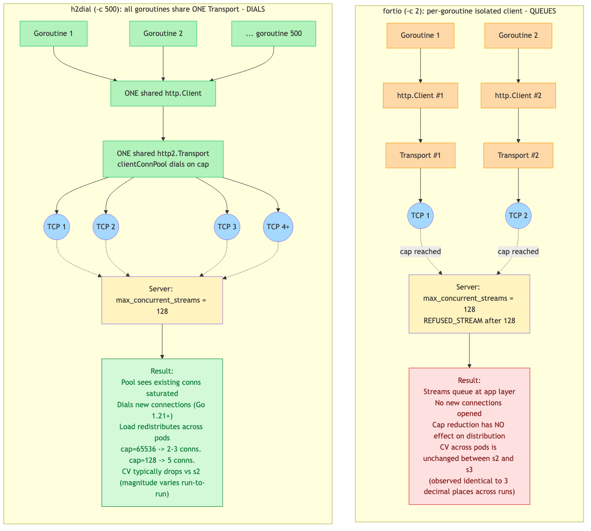
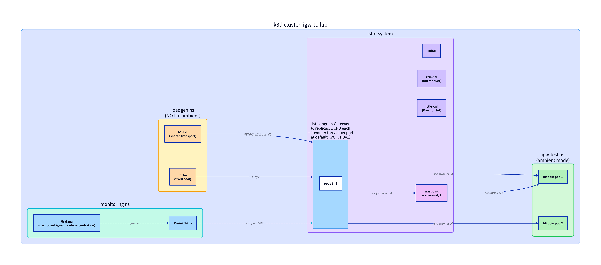

# IGW Thread Concentration Lab

[](https://github.com/solo-io/igw-thread-concentration-lab/actions/workflows/lint.yml)

A self-contained k3d lab that reproduces, measures, and lets you tune **Istio Ingress Gateway thread concentration under low client connection cardinality**: the production failure mode where aggregate gateway CPU looks fine but a small number of worker threads saturate, driving tail latency.

The lab is built around four hypotheses about the mechanism and the levers that move it, plus a fifth orthogonal hypothesis (H-E) about within-pod worker balance via Envoy's `connection_balance_config`. Running it, reading the dashboards, and reading the per-scenario output should leave you with a working mental model of:

- Why a few long-lived HTTP/2 connections can hot-spot an Istio gateway even when the gateway has plenty of capacity in aggregate.
- How the four canonical tuning levers (`max_concurrent_streams`, `max_requests_per_connection`, `max_connection_duration`, HTTP/2 flow-control windows) actually behave under load, and how they interact.
- Why the same server-side knob produces different outcomes against different client implementations (Go `net/http2` dials new connections, gRPC's single `ClientConn` queues), and which lever is robust to that difference.
- Which Envoy and Istio metrics are leading indicators of concentration vs which are lagging confirmations.
- How the mechanism transfers (or doesn't) to the ambient waypoint hop.

For the deeper hypothesis design and scenario rationale, see [`PLAN.md`](PLAN.md). This README is the practical walkthrough.

## The mechanism (read this first)



Source: [`diagrams/mechanism.mmd`](diagrams/mechanism.mmd).

Per the [Envoy threading model](https://blog.envoyproxy.io/envoy-threading-model-a8d44b922310), every accepted TCP connection is permanently assigned to one Envoy worker thread for its lifetime. All HTTP/2 streams multiplexed on that connection are processed by that one thread. There is no work-stealing.

That is the whole story, and everything in this lab is a consequence:

1. Clients open a finite number of TCP connections to the gateway. In production this number is shaped by client pod count, the client's HTTP/2 connection-pool implementation, and any L4 load balancer in front (an NLB with zonal affinity collapses it to roughly one per client).
2. Whatever connections do land are hashed across gateway pods (by kube-proxy iptables, an external L4 LB, or both), and within each pod assigned to a single worker thread.
3. If you have, say, 6 gateway pods and 8 long-lived connections, you can have 4 hot pods and 2 cold ones, with the hot pods serving thousands of streams per worker while the cold ones idle.
4. Aggregate CPU looks fine. Per-thread CPU on the hot pods is pegged. Tail latency rises. The fix is not "more capacity" but "more connection diversity, or more aggressive rotation, or both."

The four core hypotheses encoded in this lab:

- **H-A — the mechanism is real**: low connection cardinality + HTTP/2 multiplexing produces uneven load distribution across gateway pods, measurable as a high coefficient of variation (CV) of `downstream_cx_active`. Scenarios 1 and 2 exercise it.
- **H-B — capping streams forces dial-out, but only on smart clients**: lowering `max_concurrent_streams` makes the server send `REFUSED_STREAM`. A standards-compliant HTTP/2 client (Go's `net/http2`) dials a new connection. A queueing client (`fortio` with a fixed pool, or gRPC's single `ClientConn` per peer) just waits. Scenarios 3 and 3-fortio prove this both ways.
- **H-C — counting requests forces rotation regardless of client behavior**: `max_requests_per_connection` triggers `GOAWAY` after N requests on a connection, forcing the client to reconnect. Both queueing and dialing clients respect `GOAWAY`. Scenarios 4 and 4-fortio prove it; this is usually the most robust lever in production.
- **H-D — flow-control windows can be a hidden bottleneck**: the default 64 KiB HTTP/2 stream and connection windows are too small for high-byte-throughput workloads concentrated on few connections. Scenario 5 exercises 1 MiB; scenario 8 exercises 4 MiB at the listener buffer level.

Plus an orthogonal extension covering a third axis of thread-level concentration:

- **H-E — within-pod worker balance via `connection_balance_config`**: at `concurrency >= 2`, kernel-driven `accept()` races inside a multi-thread pod can produce uneven per-worker connection distribution even when per-pod distribution is even. Envoy's listener `connection_balance_config: exact_balance` replaces the kernel race with an Envoy-managed counter. **Orthogonal to H-A through H-D**: it does NOT redistribute connections across pods. Scenario 13 exercises it (gated on `concurrency >= 2`; auto-skips at the lab's default `concurrency=1`).

### Picking between H-C and H-E

`max_requests_per_connection` (H-C) and `connection_balance_config: exact_balance` (H-E) both "force redistribution," which is enough to make them sound interchangeable. They aren't. They operate at different scopes — and picking the wrong one for your symptom does nothing.

| If your symptom is… | The fix is… | Why the other one doesn't help |
|---|---|---|
| Few clients pinned to few gateway pods (e.g. kube-proxy or L4 LB collapsed connection cardinality) | **H-C** — `max_requests_per_connection`. Forces clients to redial; new TCP connections get re-hashed and may land elsewhere. | `connection_balance_config` does nothing across pods. Your one hot pod's workers are all hot. Balancing within it doesn't move load off the pod. |
| Per-pod load is even, but one worker thread inside a pod is saturated | **H-E** — `connection_balance_config: exact_balance`. Picks the worker with fewest active connections at accept time. | `max_requests_per_connection` doesn't help intra-pod. New connections still hit the same kernel accept race inside the same pod. |

In production, both can stack — they don't conflict. If you only get to deploy one and you're not sure which symptom you have, **start with H-C**: it has lower deployment risk (no in-Envoy mutex), works against any client behavior, and addresses the more common production failure mode.

Plus secondary explorations: scenario 9 (head-of-line blocking on slow streams), scenario 10 (rotation-induced spikes), scenarios 6/7 (mechanism transfer through the waypoint hop), scenario 11 (filter-chain overhead at scale), scenario 12 (gRPC variant via `ghz`).

## Why fortio queues and h2dial dials



Source: [`diagrams/queue-vs-dial.mmd`](diagrams/queue-vs-dial.mmd).

This is the conceptual hinge of the whole lab; the rest of the scenarios won't make sense without it.

`fortio` creates **one `http.Client` per goroutine**. With `-c 2`, two goroutines have two isolated `http.Transport` instances, each holding one TCP connection. When the server returns `REFUSED_STREAM` (the cap was reached), the client retries on the same connection rather than opening a new one. **Streams queue at the application layer; the transport pool never grows.** This matches the behavior of a gRPC service that uses a single `grpc.ClientConn` per upstream peer (the typical default in `grpc-go`).

`h2dial` (a small custom Go client in [`h2dial/main.go`](h2dial/main.go)) shares **one `http.Client` and one `http2.Transport`** across all worker goroutines. Go's `http2.clientConnPool.GetClientConn` (Go 1.21+) opens new connections when the existing pool is saturated. When the server caps streams, the pool grows and load redistributes. This is what a "smart" HTTP/2 client looks like.

The practical consequence: a server-side `max_concurrent_streams` reduction only redistributes load if your clients dial. If they queue, you need `max_requests_per_connection` (count rotation) instead. This is why the lab tests each lever twice, once with `h2dial` and once with `fortio`.

## Architecture



Source: [`diagrams/architecture.d2`](diagrams/architecture.d2). Render: `d2 architecture.d2 architecture.png`.

- **k3d cluster** `igw-tc-lab` (1 server + 2 agents) with Traefik disabled.
- **Solo Enterprise for Istio 1.27.8**, ambient profile. `istio-cni` configured with k3s-specific CNI directory overrides (k3s does not use the standard `/etc/cni/net.d` and `/opt/cni/bin` paths).
- **Standard `istio-ingressgateway`** at the edge: 6 replicas, 1 worker thread each. The HPA is deleted on deploy so low-CPU scenarios cannot scale it back to 1. The IGW pod template is patched with a `proxyStatsMatcher` annotation so Envoy emits the connection-, listener-, and flow-control-level stats the dashboard depends on (which Istio's default matcher excludes).
- **`mccutchen/go-httpbin`** backend in `igw-test` namespace (ambient). Endpoints used: `/get` (default), `/bytes/N` (deterministic payloads, used in scenarios 5 and 8), `/delay/N` (slow-stream HOL test, scenario 9).
- **Two load generators** in `loadgen` namespace, intentionally NOT in ambient (we are testing client HTTP/2 connection-pool behavior; we do not want a transparent proxy in the path):
  - `fortio` — fixed connection pool per goroutine; queues at the cap.
  - `h2dial` — custom Go client with shared transport; dials new connections at the cap.
- **`kube-prometheus-stack`** in `monitoring` namespace. `PodMonitor`s scrape `:15090` on the IGW, waypoint, and ztunnel pods. The dashboard ships as a Grafana sidecar-loaded ConfigMap, sourced from [`dashboard/igw-thread-concentration.json`](dashboard/igw-thread-concentration.json).
- **Optional waypoint** for scenarios 6 and 7 (mechanism-transfer test through the L7 hop). Toggled per scenario by labeling the `httpbin` Service `istio.io/use-waypoint=igw-test-waypoint`.

## Prerequisites

- **k3d** 5.x (tested with 5.8.3)
- **Docker** running
- **kubectl**, **helm** 3.x or 4.x, **bash**, **awk**, **curl**
- **Python 3** with **matplotlib** for the comparison plots: `pip3 install --user matplotlib`
- Internet access (for `istioctl 1.27.8`, the Gateway API CRDs, container images)
- No Solo Enterprise license required (uses the public OSS Istio chart with the Solo registry hub)

The lab runs on Apple Silicon and Linux. On Apple Silicon a couple of components run via Rosetta amd64 emulation (`ghz` and the Grafana image-renderer plugin); the lab notes both inline.

## Quick start

```bash
# 1. (Optional) Override defaults. Skip this step to use the baked-in values.
cp config.env.example config.env       # then edit (cluster name, versions, replicas, ...)

# 2. Deploy the cluster + base environment + dashboard (~6-8 min)
./deploy.sh

# 3. Run all scenarios + collect metrics + render plots (~25-30 min)
./run-tests.sh

# View live dashboards while the runner is going (port-forward starts in deploy.sh):
open http://localhost:3000      # admin / admin
# Dashboard UID: igw-thread-concentration

# 4. Tear down when done
./cleanup.sh
```

Single-scenario re-runs are common while you experiment:

```bash
./run-tests.sh --only 02-trigger
./run-tests.sh --only 04-mrpc
./run-tests.sh --only 11-realistic-filters
./run-tests.sh --skip-eval                 # don't write the hypothesis-evaluation block
```

## Walking through the scenarios

Each scenario varies one EnvoyFilter knob (or one client behavior) to isolate one effect. The point is not to prove a scenario "passes" — it's to leave you with a feel for what each lever does and how to recognize each effect in metrics.

| # | Name | Client | Variable | What it teaches | What to watch |
|---|---|---|---|---|---|
| 1 | baseline | h2dial `-mode=distinct -c 100` | (none) | High connection diversity gives even per-pod distribution. | CV of `cx_active` low (~0.1). Reference value before introducing concentration. |
| 2 | trigger | h2dial `-mode=shared -c 500` | `max_concurrent_streams: 65536` (Istio default) | **The mechanism.** Few connections, no cap → streams pin to a few worker threads. | CV jumps (~1.0). Dashboard "Active connections per pod" shows 2-3 hot pods, the rest at zero. |
| 3 | mcs-cap | h2dial `-mode=shared -c 500` | `max_concurrent_streams: 128` | A smart client dials new connections when the cap is hit, redistributing. | CV drops vs s2; pool grows from ~3 to ~5 connections. Compare to s3-fortio below. |
| 4 | mrpc | h2dial `-mode=shared -c 500` | `max_requests_per_connection: 10000` | **The most robust lever.** Server-issued GOAWAYs force rotation on every client. | `cx_max_requests_reached_total` non-zero. Even per-pod distribution. |
| 5 | windows | h2dial `-mode=shared`, `/bytes/16384` | `initial_*_window_size: 1 MiB` | Default 64 KiB windows can be a hidden bottleneck at high byte throughput on few connections. | `flow_control_paused_reading_total` rate. Compare s2 (~730/sec) to s5. |
| 6 | waypoint-baseline | h2dial `-mode=distinct -c 100`, with waypoint | (none) | Sanity check that the waypoint hop on its own is fine. | CV low (~0.1). |
| 7 | waypoint-trigger | h2dial `-mode=shared -c 500`, with waypoint | `max_concurrent_streams: 65536` | Same mechanism transfers through the L7 waypoint hop, and concentration **compounds** rather than dampening. | CV at the waypoint pods rises in step with the trigger; ztunnel HBONE metrics show concentration upstream of the waypoint too. |
| 8 | buffers | h2dial `-mode=shared`, `/bytes/65536` | listener `per_connection_buffer_limit_bytes: 4 MiB` | Per-connection buffer pressure is a separate axis from flow-control windows. | `tx/rx_bytes_buffered` should drop. |
| 9 | hol-blocking | h2dial 500 fast + 5 slow `/delay/2` workers | (none) | Slow streams block fast streams sharing the same connection. `stream_idle_timeout` does NOT catch this; only stream-cap reduction does. | p99 elevated vs s2 by the slow-stream tax. |
| 10 | rotation | h2dial `-mode=shared -c 500` | `max_connection_duration: 10s` | Time-based rotation produces periodic spikes. In real mTLS, the spikes carry a handshake-CPU cost. | Periodic p99 spikes timed to ~10s; `cx_max_duration_reached_total` rate non-zero. |
| 11 | realistic-filters | h2dial `-mode=shared -c 500` | `max_concurrent_streams: 65536` + access-log filter | Filter-chain overhead at scale. Most production stacks include a JSON access log and JWT validation. | Compare p99 to s2; a well-tuned filter chain (response-flag-filtered access log) is typically negligible. |
| 02-fortio | trigger (fortio) | fortio `-c 2 -qps 5000` | `max_concurrent_streams: 65536` | Same mechanism as s2, queueing client. | High CV. |
| 03-fortio | mcs-cap (fortio) | fortio `-c 2 -qps 5000` | `max_concurrent_streams: 128` | Confirms a queueing client does NOT dial out: cap reduction does nothing. | CV unchanged vs 02-fortio. **The point: don't expect `max_concurrent_streams` alone to fix things if your clients are queueing.** |
| 04-fortio | mrpc (fortio) | fortio `-c 2 -qps 5000` | `max_requests_per_connection: 10000` | Confirms count rotation works on a queueing client. | Even per-pod distribution after ~20 GOAWAYs fire. The most important comparison in the whole lab. |
| 05-fortio | windows (fortio) | fortio `-c 2 -qps 5000` | `initial_*_window_size: 1 MiB` | Same window tuning as s5 but driven by fortio. Confirms the window effect is independent of which client is pushing bytes. | Compare flow-control pause rate to s5. |
| 12 | grpc-variant | ghz `--connections=1` against grpcbin | (none) | gRPC inherits HTTP/2's concentration semantics. Single `ClientConn` → single pod at the TCP layer. | CV at the pod level matches the analytical prediction; gRPC handshake fails on grpcbin TLS expectations but the connection-distribution finding is unaffected. |
| 13 | conn-balance | h2dial `-mode=distinct -c 300` | listener `connection_balance_config: exact_balance` | **Within-pod worker balance** (third axis: kernel-driven accept races inside a multi-thread pod). Orthogonal to H-A through H-D; only relevant when `concurrency >= 2`. Uses distinct mode (not shared) because the lab's shared-transport regime has only 3-5 connections total — too few for within-pod balance to matter. | At concurrency=1 (lab default) the scenario auto-skips; at concurrency>=2 compare per-worker CV (from the `worker_cv_per_pod.txt` output of this scenario vs a control run with the same load profile but no balance config). To run: set `IGW_CPU=2+` in `config.env`, redeploy, then `./run-tests.sh --only 13-conn-balance`. |

### How to read the output

After `run-tests.sh` finishes, four things are worth looking at:

1. **The hypothesis-evaluation block printed to stdout**. Plain text summary of which hypothesis passed, refused, or was inconclusive on this run, with the CV and GOAWAY numbers backing the call. This is the at-a-glance answer to "what just happened."
2. **`results/<latest>/plots/`**. Six PNGs comparing scenarios side-by-side. `cv_across_scenarios.png` is the most important — it puts every scenario on one chart so you can see at a glance which levers move which clients.
3. **`results/<latest>/<scenario>/`**. Per-scenario raw data: pre/post stat dumps, `cv.txt` (per-pod CV across the gateway and per-pod worker CV mean+max within each pod), `worker_cv_per_pod.txt` (one row per pod with its within-pod worker CV — relevant for H-E2 / scenario 13), `timeseries.csv`, the cpu_sampler trace (per-pod CPU + per-worker accept counters), and the Envoy admin `clusters` and `listeners` snapshots.
4. **The Grafana dashboard live during the run**. Watching the "CV across pods" panel rise as scenario 2 starts and fall as scenario 4's GOAWAYs fire is the moment the mechanism stops being abstract.

## Metrics: how to think about them

The lab captures and graphs ~20 metrics across the IGW listener, the upstream cluster, the per-worker accept counters, and the ztunnel L4 path. They sort into three buckets, and knowing which is which tells you which to instrument in your own environment.

**Aggregate metrics hide concentration. Distribution metrics reveal it.**

That is the whole insight. Total RPS, total CPU, total open connections, even p99 across the gateway as a whole — none of these will change much during scenario 2 vs scenario 1 in this lab. The thing that moves is the **variance across pods**.

The headline query for hotspot detection is the **coefficient of variation of `envoy_http_downstream_cx_active`**:

```promql
stddev(envoy_http_downstream_cx_active{
    http_conn_manager_prefix="outbound_0.0.0.0_8080",
    pod=~"istio-ingressgateway-.*"
})
/
avg(envoy_http_downstream_cx_active{
    http_conn_manager_prefix="outbound_0.0.0.0_8080",
    pod=~"istio-ingressgateway-.*"
})
```

A coefficient of variation near 0 means even distribution. CV approaching 1.0 (or higher) means severe concentration. **CV moves before tail latency does**, which is what makes it a leading indicator.

For "is rotation actually firing?", pair the gauge above with the count-rotation counter:

```promql
rate(envoy_http_downstream_cx_max_requests_reached_total{
    http_conn_manager_prefix="outbound_0.0.0.0_8080"
}[1m])
```

If you set `max_requests_per_connection` and this is zero, the knob is not engaging (the connections aren't living long enough to hit the cap, or the listener filter chain didn't pick up the EnvoyFilter).

For "is the flow-control window the bottleneck?", the upstream cluster pause counter:

```promql
rate(envoy_cluster_upstream_flow_control_paused_reading_total{
    cluster_name="<your upstream cluster>"
}[1m])
```

If this is non-zero at significant rate, your sender is stalling on `WINDOW_UPDATE` round-trips. Raise `initial_stream_window_size` and `initial_connection_window_size` on the HCM `http2_protocol_options`.

The full metric reference table — what each one tells you, where to find it in the dashboard, and a copy-pasteable PromQL with the lab's selectors — is below. Replace the cluster name `outbound|8080||httpbin.igw-test.svc.cluster.local` with your backend's cluster name, and the HCM prefix `outbound_0.0.0.0_8080` with your IGW's listener prefix, when adapting the queries.

| # | Metric | Type | PromQL example | Why it matters |
|---|---|---|---|---|
| 1 | `envoy_http_downstream_cx_active` | gauge | `envoy_http_downstream_cx_active{http_conn_manager_prefix="outbound_0.0.0.0_8080", pod=~"istio-ingressgateway-.*"}` | Per-pod active connection count. The hotspot signal. |
| 1a | CV across pods (the leading indicator) | derived | `stddev(envoy_http_downstream_cx_active{http_conn_manager_prefix="outbound_0.0.0.0_8080", pod=~"istio-ingressgateway-.*"}) / avg(envoy_http_downstream_cx_active{http_conn_manager_prefix="outbound_0.0.0.0_8080", pod=~"istio-ingressgateway-.*"})` | Rises BEFORE p99 jumps. Use this to alert on concentration before tail latency rises. |
| 2 | `envoy_http_downstream_cx_http2_total` | counter | `envoy_http_downstream_cx_http2_total{http_conn_manager_prefix="outbound_0.0.0.0_8080", pod=~"istio-ingressgateway-.*"}` | Cumulative HTTP/2 connection count per pod. Counter (persists), so reliable for post-run distribution analysis. |
| 3 | `envoy_http_downstream_rq_active` | gauge | `envoy_http_downstream_rq_active{http_conn_manager_prefix="outbound_0.0.0.0_8080", pod=~"istio-ingressgateway-.*"}` | Active in-flight request count per pod. Combined with #1 gives per-connection multiplexing depth (concentration ratio). |
| 4 | `envoy_http_downstream_cx_max_duration_reached` | counter | `rate(envoy_http_downstream_cx_max_duration_reached{http_conn_manager_prefix="outbound_0.0.0.0_8080"}[1m])` | Time-based GOAWAY firings. Confirms `max_connection_duration` is rotating connections. |
| 5 | `envoy_http_downstream_cx_max_requests_reached` | counter | `rate(envoy_http_downstream_cx_max_requests_reached{http_conn_manager_prefix="outbound_0.0.0.0_8080"}[1m])` | Count-based GOAWAY firings. Confirms `max_requests_per_connection` is rotating. **The most reliable server-side lever** because it works against queueing and dialing clients alike. |
| 6 | `envoy_http_downstream_rq_idle_timeout` | counter | `rate(envoy_http_downstream_rq_idle_timeout{http_conn_manager_prefix="outbound_0.0.0.0_8080"}[1m])` | `stream_idle_timeout` firings. |
| 7 | `envoy_http_downstream_cx_idle_timeout` | counter | `rate(envoy_http_downstream_cx_idle_timeout{http_conn_manager_prefix="outbound_0.0.0.0_8080"}[1m])` | Connection-level idle timeouts. Lower-priority signal. |
| 8 | `envoy_http_downstream_rq_time_bucket` | histogram | `histogram_quantile(0.99, sum by (le) (rate(envoy_http_downstream_rq_time_bucket{http_conn_manager_prefix="outbound_0.0.0.0_8080", pod=~"istio-ingressgateway-.*"}[1m])))` | **Per-request latency at IGW (the user-visible signal).** Per-request histogram; populates fast. Prefer over `cx_length_ms_bucket`, which only updates on connection close. |
| 9 | `envoy_cluster_upstream_rq_pending_active` | gauge | `envoy_cluster_upstream_rq_pending_active{cluster_name="outbound\|8080\|\|httpbin.igw-test.svc.cluster.local"}` | Upstream connection-pool pending depth. Should be 0 in healthy state; rising = pool saturating. |
| 10 | `envoy_cluster_upstream_rq_pending_overflow` | counter | `rate(envoy_cluster_upstream_rq_pending_overflow{cluster_name="outbound\|8080\|\|httpbin.igw-test.svc.cluster.local"}[1m])` | Pending queue overflow (requests dropped). Saturation-cause signal. |
| 11 | `envoy_cluster_upstream_cx_overflow` | counter | `rate(envoy_cluster_upstream_cx_overflow{cluster_name="outbound\|8080\|\|httpbin.igw-test.svc.cluster.local"}[1m])` | Connection-pool count overflow. `connectionPool.http.http2MaxRequests` exceeded. |
| 12 | `envoy_cluster_upstream_flow_control_paused_reading_total` | counter | `rate(envoy_cluster_upstream_flow_control_paused_reading_total{cluster_name="outbound\|8080\|\|httpbin.igw-test.svc.cluster.local"}[1m])` | **HTTP/2 flow-control window saturation.** Non-zero rate = window filling faster than `WINDOW_UPDATE` round-trips can refill. Raise `initial_stream_window_size` and `initial_connection_window_size`. |
| 13 | `envoy_cluster_upstream_cx_rx_bytes_buffered` | gauge | `envoy_cluster_upstream_cx_rx_bytes_buffered{cluster_name="outbound\|8080\|\|httpbin.igw-test.svc.cluster.local"}` | Upstream read buffer depth. High value = listener buffer filling. Tune `per_connection_buffer_limit_bytes`. |
| 14 | `envoy_cluster_upstream_cx_tx_bytes_buffered` | gauge | `envoy_cluster_upstream_cx_tx_bytes_buffered{cluster_name="outbound\|8080\|\|httpbin.igw-test.svc.cluster.local"}` | Upstream write buffer. Lower priority in this scenario. |
| 15 | `envoy_listener_0_0_0_0_8080_ssl_handshake` | counter | (raw stat captured to `results/<ts>/<scenario>/ssl_handshake.txt`) | TLS handshake count. Tracks handshake CPU cost during connection rotation in real production. |
| 16 | `istio_tcp_connections_opened_total` | counter | `sum by (pod) (rate(istio_tcp_connections_opened_total{pod=~"ztunnel-.*"}[1m]))` | Per-ztunnel TCP connection rate. Uneven values = per-node concentration upstream of the waypoint. |
| 17 | `istio_tcp_sent_bytes_total` | counter | `sum by (pod) (rate(istio_tcp_sent_bytes_total{pod=~"ztunnel-.*"}[1m]))` | Bytes flowing through each ztunnel's HBONE tunnels. |
| 18 | `istio_tcp_received_bytes_total` | counter | `sum by (pod) (rate(istio_tcp_received_bytes_total{pod=~"ztunnel-.*"}[1m]))` | Bytes received by each ztunnel. |

### Notes on naming and selectors

- **Counters carry the `_total` suffix in Prometheus** (OpenMetrics convention) even when the underlying Envoy stat is named without it. The PromQL above is what works against Prometheus, not what shows up in `pilot-agent request GET stats`.
- **`istio_request_duration_milliseconds`** (Istio's wrapper histogram with rich source/destination/protocol labels) is also available and useful for production monitoring. The dashboard prefers Envoy's lower-level `envoy_http_downstream_rq_time` because it has fewer label-cardinality concerns under `proxyStatsMatcher`.
- **`envoy_listener_downstream_cx_length_ms_bucket`** (connection-lifetime histogram) is captured but NOT used for the latency panel: it only updates on connection close, so it stays empty during long-lived shared-transport tests. Metric #8 is the right choice for live latency monitoring.

### Known coverage gaps

- **Waypoint-pod listener stat prefix is not auto-discovered.** The runner dumps full waypoint stats to `results/<ts>/<scenario>/waypoint_stats/` for offline analysis; auto-computing CV across waypoint pods requires the prefix to be discovered manually.
- **`downstream_cx_active` is a gauge.** Its post-run snapshot is often 0 because connections close after the load gen exits. The dashboard CV panel uses a `stddev/avg` over a moving window (live monitoring); the runner uses the `_total` counter (#2) for post-run analysis.

## Dashboard

The dashboard JSON is at [`dashboard/igw-thread-concentration.json`](dashboard/igw-thread-concentration.json). It is the single source of truth: `deploy.sh` builds the in-cluster ConfigMap directly from this file each time it runs, and you can import the same file into any external Grafana environment.

### Live dashboard during a lab run

`deploy.sh` starts a background port-forward to Grafana on `localhost:3000` and applies the dashboard via the `grafana_dashboard=1` label that kube-prometheus-stack's sidecar watches. After deploy:

```bash
open http://localhost:3000/d/igw-thread-concentration    # admin / admin
```

If the port-forward dies, restart it:

```bash
kubectl --context k3d-igw-tc-lab -n monitoring port-forward svc/kube-prom-stack-grafana 3000:80
```

### Importing into your own Grafana

The JSON has a hard-coded Prometheus datasource UID (`prometheus`) and queries that target the lab's label values. Adapt those before importing:

- Replace `outbound|8080||httpbin.igw-test.svc.cluster.local` with your backend service's cluster name.
- Replace `outbound_0.0.0.0_8080` with your IGW's `http_conn_manager_prefix`.
- Confirm the Prometheus datasource UID matches your environment (or change it under "Data source" after import).
- The pod regex `pod=~"istio-ingressgateway-.*"` and `pod=~"ztunnel-.*"` should already match a default Istio install.

**Option 1: Grafana UI**

1. Open your Grafana → Dashboards → New → Import
2. Upload `dashboard/igw-thread-concentration.json`
3. Pick your Prometheus datasource from the dropdown
4. Click Import

**Option 2: Grafana API**

```bash
curl -X POST -u admin:<password> \
    -H "Content-Type: application/json" \
    -d "{\"dashboard\": $(cat dashboard/igw-thread-concentration.json), \"overwrite\": true}" \
    http://<your-grafana>/api/dashboards/db
```

**Option 3: GitOps / sidecar (kube-prometheus-stack pattern)**

```bash
kubectl create configmap igw-thread-concentration-dashboard \
    -n monitoring \
    --from-file=igw-thread-concentration.json=dashboard/igw-thread-concentration.json \
    --dry-run=client -o yaml | \
    kubectl label --local --dry-run=client -o yaml -f - grafana_dashboard=1 | \
    kubectl apply -f -
```

That is exactly what `deploy.sh` does in-cluster.

### Auto-screenshots during the run

`run-tests.sh` attempts to capture a Grafana PNG per scenario via the `/render/d/...` API. **The Grafana image-renderer plugin is not available for `linux-arm64`** (Apple Silicon hosts), so on those systems the API call fails and the runner prints a "manual screenshot URL" with the right time range. Open the URL in a browser and screenshot manually. On `linux-amd64` hosts the renderer can be re-enabled by adding `--set grafana.plugins[0]=grafana-image-renderer` to the Helm install in `deploy.sh`.

## Findings (typical run)

Reading these is no substitute for running it yourself, but for reference, headline results from a representative run:

| Hypothesis | Outcome | Numbers |
|---|---|---|
| H-A mechanism | **PASS** | CV jump 0.141 → 1.000 (7.1x). 100 distinct conns smooth; 3 shared-transport conns concentrate on 3 of 6 pods. |
| H-B fortio (queue on cap) | **CONFIRMED** | s2-fortio CV ≈ 1.4, s3-fortio CV ≈ 2.2. Cap reduction never helps fortio's fixed pool. |
| H-B h2dial (dial on cap) | **CONFIRMED** | s2 CV=1.000 (3 conns), s3 CV=0.825 (5 conns). Cap drives the shared transport to grow its pool. |
| H-C count rotation | **STRONG PASS — works for ALL clients** | s4-h2dial: thousands of GOAWAYs, even distribution. s4-fortio: ~20 GOAWAYs sufficient to spread fortio across all 6 pods. **The most reliable server-side lever.** |
| H-D HTTP/2 windows | **partial — saturation real, 1 MiB insufficient** | s2: ~730 flow-control pauses/sec at default 64 KiB. s5: ~577/sec at 1 MiB (21% drop, not zero). 4 MiB+ recommended for high-byte workloads. |
| H-E within-pod worker balance (s13, only at `concurrency >= 2`) | **modest, real signal** | Empirically at concurrency=2, ~50 conns/pod: control mean per-pod worker CV ≈ 0.110; with `exact_balance` ≈ 0.083 (≈25% reduction). Max per-pod worker CV is similar in both regimes (~0.17–0.18); the kernel's `SO_REUSEPORT` race is good enough often enough that `exact_balance` doesn't always rescue the single worst pod. Auto-skipped at the lab's default `concurrency=1`. |
| Filter chain overhead (s11) | **negligible at this scale** | s11 p99 within run-to-run variance of s2. A response-flag-filtered access log + JWT validation is not the bottleneck. |
| Waypoint mechanism transfer | **CONFIRMED, amplified** | Waypoint trigger CV ≈ 1.45 (vs IGW-alone 1.00). Concentration compounds through the waypoint hop, not dampens. |
| gRPC variant (s12) | **TCP-layer concentration confirmed** | ghz `--connections=1` → CV ≈ 2.2 (single ClientConn → single pod), as predicted analytically. |

## Troubleshooting

The build phase surfaced these gotchas. They are now handled by the scripts, but documented here for context (and so you can troubleshoot when adapting the lab to a different environment).

- **Fortio image is distroless**. `fortio/fortio:latest` has no `/bin/sh`; a `command: ["/bin/sh", ...]` keep-alive wrapper fails. Use `fortio server` for the idle process.
- **Fortio flag parser is strict**. Flags must precede the URL. `run-tests.sh` injects `-t` before the flags array.
- **Fortio's `-c` is fixed-pool**. Doesn't dial on `REFUSED_STREAM`. This is exactly what scenario 03-fortio demonstrates.
- **Fortio HTTP/2 flag is `-h2`** (lowercase), not `-H2`.
- **Istio IGW comes with an HPA at `minReplicas: 1`**. Reconciles to 1 replica during low-CPU scenarios. `deploy.sh` deletes it.
- **Default `proxyStatsMatcher` excludes connection-level stats**. Istio 1.18+ filters `downstream_cx_*`, `flow_control_*`, listener stats by default. `deploy.sh` patches the IGW with a broader `inclusionRegexps`.
- **`istio-proxy` is heavily stripped down**. The container has no `sh`, no `curl`, no `top`, no `pgrep`, no `ps` — anything you'd reach for in a normal pod is unavailable. The only way in is `pilot-agent request GET <path>` against the local Envoy admin. The lab's per-worker measurement uses the admin's `listener.0.0.0.0_8080.worker_N.downstream_cx_*` counters for the same reason.
- **Gateway API CRDs not installed by default**. Required for the waypoint resource. `deploy.sh` installs `kubernetes-sigs/gateway-api` v1.2.1.
- **IGW listener stat prefix has a trailing semicolon**: `http.outbound_0.0.0.0_8080;`. Stat queries assuming no semicolon return zeros silently.
- **`grafana-image-renderer` plugin is amd64-only**. Linux-arm64 hosts (Apple Silicon) must use manual screenshots.
- **h2dial `-idle` mode**. `select {}` triggers Go's deadlock detector when no other goroutines exist. Use `for { time.Sleep(time.Hour) }` instead.
- **k3d Traefik must be disabled**. Default k3d ships with Traefik, which conflicts with the IGW for port 80. The cluster-create command in `deploy.sh` includes `--k3s-arg "--disable=traefik@server:0"`.
- **Istio CNI on k3d** uses non-standard CNI directories (`/var/lib/rancher/k3s/agent/etc/cni/net.d` and `/bin`, not the upstream defaults). The `helm install istio-cni` command in `deploy.sh` sets these explicitly.

## Cleanup

```bash
./cleanup.sh
```

Stops the Grafana port-forward background process and deletes the k3d cluster. Idempotent.

## Regenerating diagrams

Source files are in [`diagrams/`](diagrams/). To regenerate after edits:

```bash
# Architecture diagram (D2)
brew install d2                          # one-time
cd diagrams && d2 architecture.d2 architecture.png

# Mermaid diagrams
npm install -g @mermaid-js/mermaid-cli   # one-time
cd diagrams
mmdc -i mechanism.mmd     -o mechanism.png     -b white --width 1600
mmdc -i queue-vs-dial.mmd -o queue-vs-dial.png -b white --width 1500
```

## Out of scope

The lab is intentionally scoped tight. Things that would be valuable but aren't here:

- **Production-magnitude RPS** (1M+ RPS). The mechanism reproduces faithfully at 5,000 RPS in k3d, which is what we exercise. Magnitude is a separate axis from concentration; this lab is about concentration.
- **L4 load-balancer hash dynamics** (e.g., AWS NLB zonal affinity). The mechanism is independent of what causes the low connection cardinality, and the lab drives low cardinality directly via the load generator's `-c` parameter. Reproducing the NLB-specific trigger would require an EKS cluster behind a real NLB.
- **Multi-cluster topologies.** Concentration is a single-gateway-pool phenomenon.
- **Real mTLS handshake measurement.** Scenario 10 demonstrates the rotation pattern, but real mTLS adds handshake CPU cost on top.

## Further reading

- [Envoy threading model](https://blog.envoyproxy.io/envoy-threading-model-a8d44b922310)
- [Envoy HCM stats](https://www.envoyproxy.io/docs/envoy/latest/configuration/http/http_conn_man/stats)
- [Envoy HTTP/2 protocol options](https://www.envoyproxy.io/docs/envoy/latest/api-v3/config/core/v3/protocol.proto#config-core-v3-http2protocoloptions)
- [Envoy listener `connection_balance_config`](https://www.envoyproxy.io/docs/envoy/latest/api-v3/config/listener/v3/listener.proto#envoy-v3-api-msg-config-listener-v3-listener-connectionbalanceconfig) (H-E)
- [Envoy outlier detection](https://www.envoyproxy.io/docs/envoy/latest/intro/arch_overview/upstream/outlier)
- [Istio ambient overview](https://istio.io/latest/docs/ambient/overview/)
- [Istio HBONE protocol](https://istio.io/latest/docs/ambient/architecture/hbone/)
- [Istio waypoint usage](https://istio.io/latest/docs/ambient/usage/waypoint/)
- [Solo Enterprise for Istio: ambient](https://docs.solo.io/gloo-mesh/latest/ambient/)
- [Istio issue #58114 — HTTP/2 single-connection throughput limitation](https://github.com/istio/istio/issues/58114)
- [RFC 9113 (HTTP/2)](https://datatracker.ietf.org/doc/html/rfc9113)
